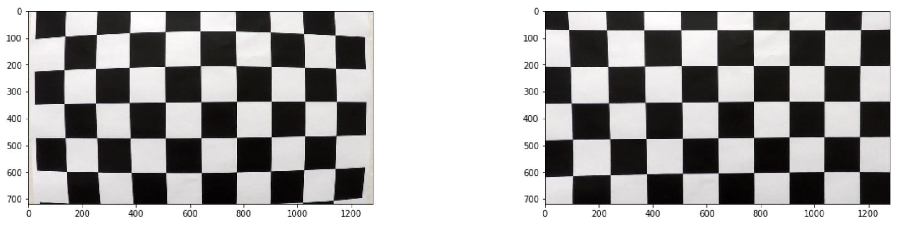
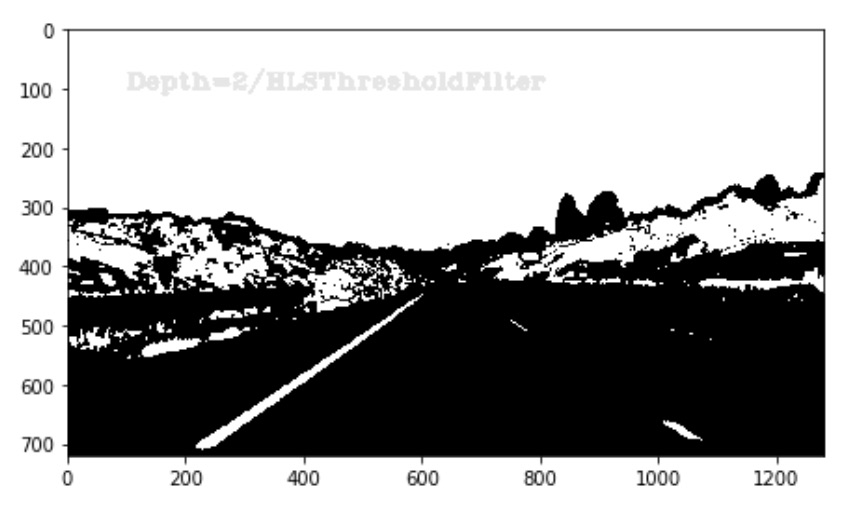
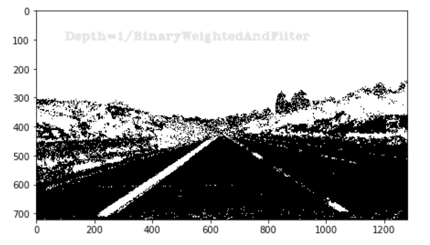
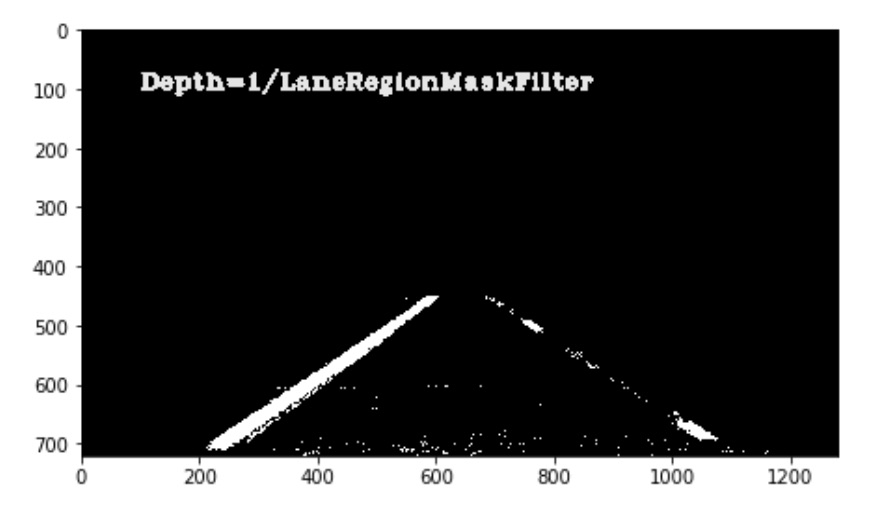
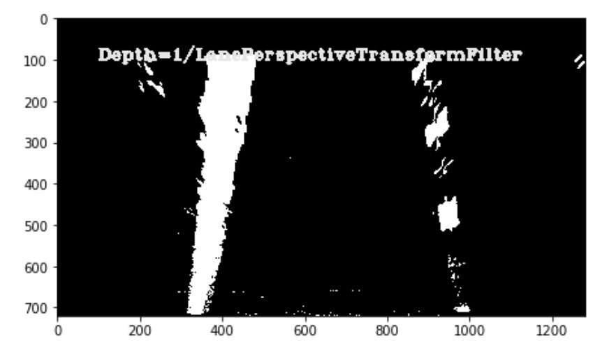
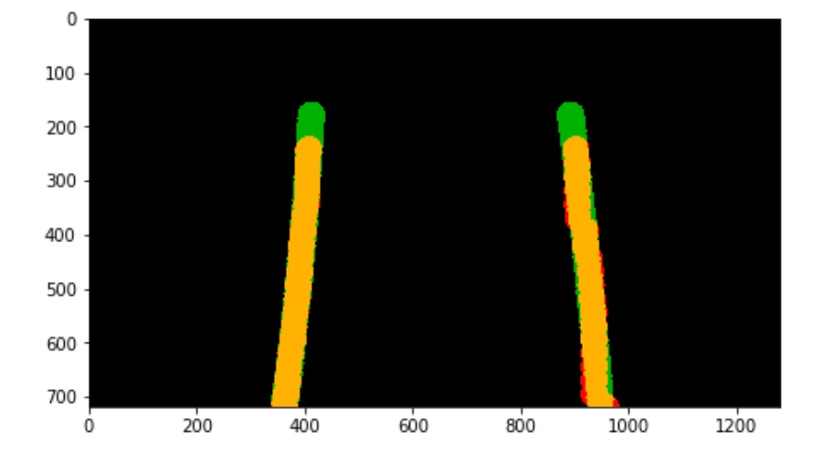
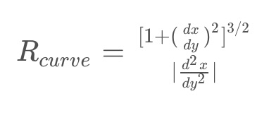
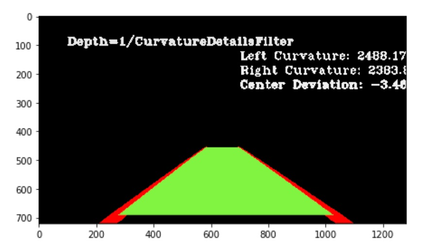
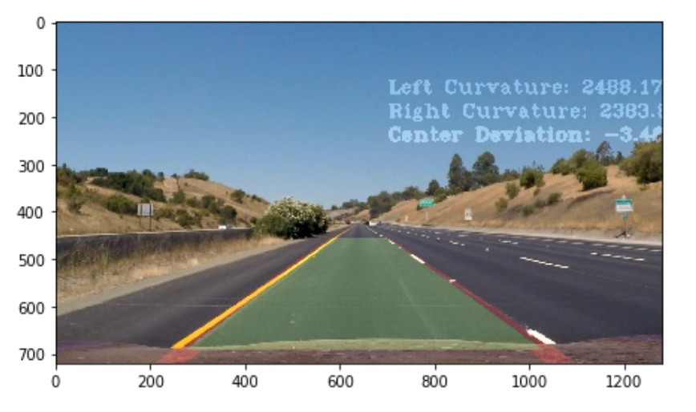

# Advanced lane finding

Objective of the project is to use computer vision techniques to detect lane lines in a video stream. The rest of the document is organized as:

1. [Problem setup](#problem_setup)
2. [Pipeline](#pipeline)
3. [Result](#results)
4. [Reflection](#reflection)

## <a name="problem_setup">Problem setup</a>
Given video of car on road with lanes, the task is to detect the lanes and mark them. The video is taken from the front center camera of the car. There are additional images taken with the same camera for camera calibration.

## <a name="pipeline">Pipeline</a>
Image processing and computer vision algorithms are applied to the images to detect the lanes. Pipeline is setup as follows:

```python
composite_gradient_filter = and_filters([
    gradx_threshold_filter,
    grad_mag_threshold_filter,
    grad_dir_threshold_filter
])

chain = FilterChain([
    undistort_filter,
    blur_filter,
    weighted_and_filters([
        s_threshold_filter, # Thresholded S-channel binary output
        FilterChain([
            grayscale_filter, # Thresholded grayscale output
            composite_gradient_filter
        ]),
        FilterChain([
            s_threshold_filter,
            composite_gradient_filter
        ]),
        FilterChain([
            s_channel_filter, # Raw S-channel output
            composite_gradient_filter
        ])
    ], 0.25),
    lane_region_mask_filter, # Mask lane region
    lane_perpective_transform_filter, # Perspective transform
    blur_filter, # Blur to remove noise
    lane_line_detector, # Detect lane lines
    inverse_lane_perpective_transform_filter, # Invert perspective transform
    curvature_details_filter # Add curvature and lane deviation details
])
```

The whole pipeline is implemented as a series of filters that are stacked on top of each other. The filter chain is powerful enough to apply boolean operations of filters (For eg: OR/AND/Weighted AND). Weighted AND is a fuzzy boolean expression which can be special cased to regular AND/OR. Using weighted AND allows for filters to vote at a pixel level.

### Camera calibration and undistortion
Camera is calibrated using chessboard images provided as part of the problem. OpenCV camera calibration methods were used to calibrate the camera and calculate the distortion coefficients. These coefficients are then used in a filter to perform undistortion.

Chessboard images undistortion


### Blur
Bluring is applied to enable better gradient calculation. Bilateral filtering in OpenCV is used because it has good properties of smoothing continuous surfaces while keeping edges sharp which is what we need.

### Colorspace thresholding
Saturation channel from HLS color spacing was found to be good for identifying lanes. This was specified in the class too. We use a simple thresholding on s-channel to create a binary image output.

| Original | Transformed
| :---: | :---:
|  | 

### Gradient thresholding
Three gradient thresholds (grad-x-threshold, grad-magnitude-threshold, grad-direction-threshold) are ANDed. The ANDed composite then applied to thresholded s-channel binary output, raw s-channel output and thresholded grayscale. The idea behind this is that gradient thresholds applied on grayscale thresholded image will keep white lanes. Similarly yellow lanes will be retained by applying the same gradient thresholds on s-channel. An OR of thresholded s-channel, and gradient thresholds is computed. This will ensure that both yellow and white lane lines are captured.

| Original | Transformed
| :---: | :---:
|  | 

### Lane region mask
This is an approach that was taken from the first lane finding project. A rough region where the lane will be found is defined. This region is the used to mask only the lane region.

| Original | Transformed
| :---: | :---:
|  | 

### Perspective transform
Perspective transform is applied to the masked area to get a top view of the lane lines.

| Original | Transformed
| :---: | :---:
|  | 

### Lane line detection
Lane line detection uses the techniques taught in the class.

1. Moving window based lane detection from scratch
2. Guided lane pixel detection by searching for pixels around a known lane line.
3. Smoothing fit coefficients across multiple historical frames (10 in this case)

| Original | Transformed
| :---: | :---:
|  | 

### Radius of curvature
Radius of curvature is calculated by first scaling image pixels to real world points. The scaled points are then fit with a polynomial (2 degree) and its radius of curvature is computed using the formula:



| Original | Transformed
| :---: | :---:
|  | 

### Plotting lanes on image
The identified lane region with lane line is the superimposed on the original image:

| Original | Transformed
| :---: | :---:
|  | 

## <a name="results">Result</a>
[Video](https://github.com/rohithmenon/carnd/blob/master/advanced_lane_finding/output/project_video.mp4?raw=true) with lane markings.

## <a name="reflection">Reflection</a>
The pipeline works pretty well on the project video. It performs poorly on the challenge problems because the thresholds are not generic enough to solve the problem of lane detection completely. Some of the places where the pipeline would fail is when there are huge patches of shadows or missing lane lines. The pipeline also fails when there is too much light (when run on harder challenge). An alternate approach I would like to try out is a convolutional neural network that learns detect lane pixels. Lane lines identified from the first video can be used as training set (with brightness and hue variation augmentations) to predict the lane pixels. Such an approach will generalize better than having to define custom thresholds and performing search in this in threshold space.
