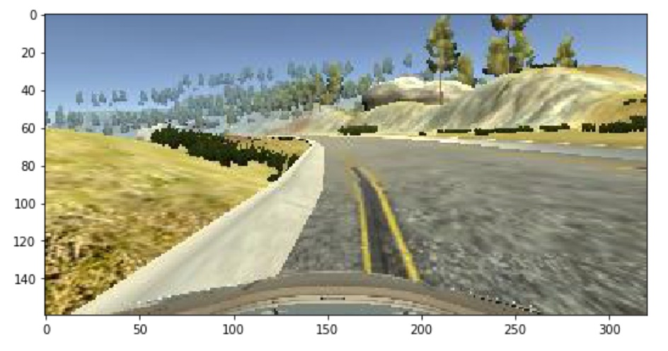

# Behavioral cloning

Objective of the project is to train a deep neural network to steer autonomously by feeding it data from human driving. Motivation behind using a neural network is that it has shown state of the art performance in computer vision which is a fundamental for this problem. Also feature extraction is automatic while the network learns to steer. The rest of the document is organized as:

1. [Problem setup](#problem_setup)
2. [Data collection](#data_collection)
3. [Model architecture](#model_architecture)
4. [Training and validation](#training)
5. [Simulation](#simulation)
6. [Improvements](#improvements)

## <a name="problem_setup">Problem setup</a>
A simulator is provided that can be used to generate training data for steer angle. The simulator can also receive steering angles from a trained model. This is used to test the model for autonomous steering. Goal of the project is for the model to steer the car so that it stays within the drivable part of the road.

## <a name="data_collection">Data collection</a>
Like mentioned in the above section, data collection is performed using the simulator. This is one of the most important step as part of the project. For the purpose of training the model, the following driving data was collected from track1:

1. Two laps in the center of the track.
2. Two laps in the center of the track in the opposite direction.
3. Multiple camera shots.

 | Center | Left | Right
 | :---: | :---: | :---:
 |  |  | 

4. Drive on either side of the tracks.

 | Left | Right
 | :---: | :---:
 |  | 

## <a name="model_architecture">Model architecture</a>
Model architecture is the same as that found in 'End-to-End Deep Learning for Self-Driving Cars' from Nvidia. This model provides the lowest validation loss, and the smoothest steering angle prediction. The network is setup to perform regression to predict steering angles.

### Model evolution:

* Single fully connected layer
* LeNet (3 epochs, validation loss: 0.0071)

2605/2604 [==============================] - 132s 51ms/step - loss: 0.0103 - val_loss: 0.0084
Epoch 2/3
2605/2604 [==============================] - 131s 50ms/step - loss: 0.0068 - val_loss: 0.0075
Epoch 3/3
2605/2604 [==============================] - 131s 50ms/step - loss: 0.0054 - val_loss: 0.0071

* Nvidia end-to-end network for self-driving (3 epochs, validation loss: 0.0071)
2605/2604 [==============================] - 126s 48ms/step - loss: 0.0100 - val_loss: 0.0076
Epoch 2/3
2605/2604 [==============================] - 124s 48ms/step - loss: 0.0081 - val_loss: 0.0080
Epoch 3/3
2605/2604 [==============================] - 124s 48ms/step - loss: 0.0074 - val_loss: 0.0061

## <a name="training">Training and validation</a>
Images from driving data is augmented using techniques under data collection. They are then split into train and validation groups. 10% of the data is set aside for validation.

### Training setup
1. Minimize mean squared error
2. Adaptive learning rate using Adam
3. 50% dropouts in full connected layers
4. Normalization of data at input
5. Crop top 60 and bottom 20 pixels to remove non-track image sections

### Training and validation loss

## <a name="simulation">Simulation</a>

## <a name="improvements">Improvements</a>

