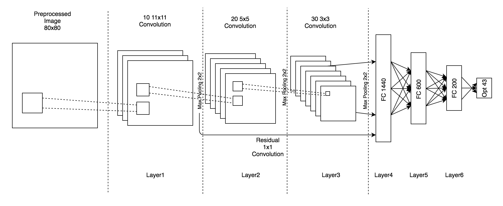
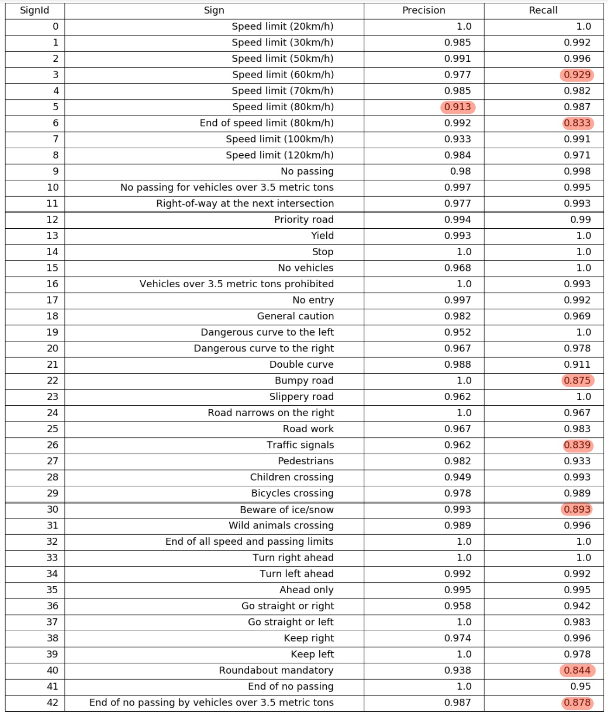
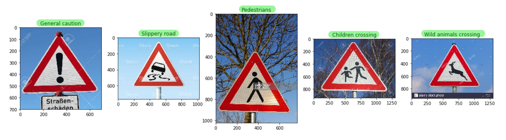
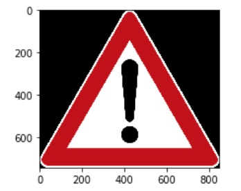

# Project Report: Traffic Sign Recognition

Objective of the project is to demonstrate the use of deep learning, in particular the use of convolutional neural networks for the task of classifying German traffic signs. Deep learning has been pretty successfully used in recent years to get state of the art performance on image classification tasks (most recently capsule networks from Hinton et al). The rest of the document is organized as:

1. [Problem setup](#problem_setup)
2. [Data exploration](#data_exploration)
3. [Preprocessing](#preprocessing)
4. [Model design](#model_design)
5. [Training, performance and tuning](#training)
6. [Model visualization](#model_visualization)
7. [Improvements](#improvements)

## <a name="problem_setup">Problem setup</a>
Images of German traffic signs which are annotated with the signal type is provided. The problem is to design and train a convolutional neural network to classify such images. Expected validation accuracy for the model should be atleast 93%.  The trained model is then to be tested on 5 German traffic sign images from internet.

## <a name="data_exploration">Data exploration</a>
Images provided in the data set are color images of size 32x32 pixels. There are 43 unique signal types or labels for the data. Images are cropped from photos that contain these traffic signals.

| Dataset stats  | # of images |
|:---:|---:
|Number of training examples|34799
|Number of test examples|12630
|Number of labels|43

#### Sample of training images

#### Label distribution in training images

## <a name="preprocessing">Preprocessing</a>
Images are preprocessed before fed into the model for training and testing. Preprocessing is done so that the model can fit the data easily and does not have to learn the preprocessing logic. While this makes it easier to train, it may also be the case that preprocessing that is chosen here is not ideal. With a much larger/complex model and  more computational resources, one may be able to let the model learn the necessary preprocessing logic. Preprocessing steps we have chosen include:

1. Resizing the 32x32 images to 80x80 images with Lanczos interpolation

   Resizing images using Lanczos interpolation tends to give more details to the image visually. The idea is that this interpolation will help the model to learn more about the shape of the signals. It also allows for convolutions at a subpixel level (Because 32x32 image is converted to 80x80, and assuming interpolation does the right job, we have 2.5 pixels per origin pixel).

2. Unsharp masking to sharpen the images

   Applying sharpening to the images helps with making the signal shapes more pronounced.

3. Converting images to grayscale

   The idea behind this is that it is easier to learn the shapes in grayscale than in 3 channel color images. There might be a better combination of the 3 channels that may result in better identification of the shapes, but grayscale is a reasonable start. [Pierre Sermanet and Yann LeCun in Traffic Sign Recognition with Multi-Scale Convolutional Networks, show good results with grayscale images]

4. Contrast enhancement using Contrast Limited Adaptive Histogram Equalization

   Improving contrast by histogram equalization helps preserve the shape while making the objects in the images more visually pronounced. This should help with better learning good features for different signal types.

#### Sample of images after preprocessing

One can see how preprocessed images are more clearer and detailed than the original images.

Also one can notice that the label distribution in the training set has some labels that are under-represented. To compensate, we sample more images from those under-represented image classes. Therefore the new training image set distribution has most of the image classes reasonably represented. Under-represented classes are sampled so that every image class contains atleast k images (k is the average number of images per class before sampling).

#### Distribution of preprocessed images after sampling under-represented image classes

## <a name="model_design">Model design</a>
The model used has three layers of convolution/max-pooling followed by three fully connected layers. Leaky relu is used as the non-linearity because it has better resilience to vanishing/exploding gradients problem. Batch normalization is applied before non-linearity to ensure that the values are of zero mean and unit variance before applying leaky relu. Detailed architecture of the model with number of filters per layer etc. are given below:

#### Model Architecture

The model is inspired by LeNet and ResNet. ResNet has the idea that deeper networks should not perform worse than a corresponding shallow network. The shortcut between layer1 and layer3 output is a resnet identity connection. The 1x1 convolution is used to project layer1 output to match layer3 output for concatenation. The resnet idea is also similar to the multi-stage architecture proposed in Traffic Sign Recognition with Multi-Scale Convolutional Networks [Pierre Sermanet and Yann LeCun]. Fully connected layers have 40% dropouts to prevent overfitting.

Attempt was made to use inception module [Christian Szegedy et al, Going deeper with convolutions] but it was extremely time consuming to train even with a GPU.

## <a name="training">Training, performance and tuning</a>
#### Training
The model described above is setup to minimize for cross-entropy of ground truth labels. Objective function in some settings additionally also minimizes sum of squared weights (l2 regularization). This helps in preventing the model to overfit the training data. Note that this regularization is on top of the dropouts we have setup in the fully connected layers. Batch stochastic gradient decent is used as the optimizer with adaptive moments (ADAM) for learning rate. For the above model we have the following hyperparameters:
1. Learning rate
2. Batch size
4. Epochs
5. Regularization constant
6. Dropout percentage [keep_prob = 0.6]
7. Alpha for leaky relu [0.2]
8. Betas for Adam [defaults]

A very simple hyper parameter search is done using a grid search for (best result in bold):
1. Learning rate [0.0001, 0.0005, **0.001**, 0.005, 0.01, 0.05]
2. Batch size [**32**, 64, 128, 256]
3. Epochs [20, **30**, 40]
4. Regularization [**0.0**, 0.0001, 0.001, 0.01]

**Model Evolution**
1. LeNet with minor modifications to take in 3 channel input and output of 43 labels. (88.5%)
2. LeNet with Grayscale: (92.2%)
3. LeNet with Grayscale + CLAHE: (94.7%)
4. LeNet with Grayscale + Sharpening: (93.9%)
5. More layers (3 convolution layers) + Grayscale + CLAHE Sharpening: (97.2%)
6. Dropout + More layers (3 convolution layers) + Grayscale + CLAHE + Sharpening: (98.2%)
7. Dropout + More layers (3 convolution layers) + Resize 80x80 + Grayscale + CLAHE Sharpening: (98.6%)
8. Resnet + Dropout + More layers (3 convolution layers) + Resize 80x80 + Grayscale + CLAHE Sharpening: (98.8%)
9. Regularization + Resnet + Dropout + More layers (3 convolution layers) + Resize 80x80 + Grayscale + CLAHE Sharpening: (98.4%).

#### Validation and test performance
For the above parameter setting, the best validation set accuracy is 98.8%. For the model, the accuracy on test set is 97.9%. The overall accuracy is well above the required 93.0%. But lets see per class precision and recall for the same model. Precision and recall that are below 93% are highlighed in red.

#### Performance on new images
Two classes of new images are considered.
1. Perfect images of traffic signals
2. Photos of traffic signals

The model is able to do correct predictions (100% accuracy) on both perfect images and on photo images.

**Performance on perfect images**

**Performance on photo images**

#### Top-k predictions
**Top-k predictions for perfect images**

One can notice that the model is pretty confident about the predictions. The difference between probability of the top scored class and the next heightest class is high, which indicates that the model is very confident about the prediction.

**Top-k predictions for photo images**

In the case of photo images, the model is not very confident about pedestrian signal and slippery roads. The prediction probability is < 0.26. For all other cases, the model has the correct label classification probability of > 0.95.

## <a name="model_visualization">Model Visualization</a>
Here we visualize the convolution layers for a sample image: General Caution.

#### Layer visualization
**Layer1**

**Layer1 + Max pooling**

**Layer2**

**Layer2 + Max pooling**

**Layer3**

**Layer3 + Max pooling**

## <a name="improvements">Improvements</a>
There are multiple directions in which this project can be improved:

##### Data processing
1. Data augmenting by perturbing, rotating the original image
2. Acquire more data for low precision/recall classes

##### Modelling
1. Deeper/wider networks - [Inception modules]
2. Better hyper parameter tuning - It is pretty time consuming to search the hyper parameter space. Google cloud ML provides a much better technique of bayesian optimization for hyper parameter tuning.
3. Alternative architectures.

##### ML Infrastructure
1. Telsa K80 GPU was used to train and provided a great speed up compared to cpu. GPU still is pretty slow for hyper parameter search. Exploring Google distributed ML platform will speed up training.

