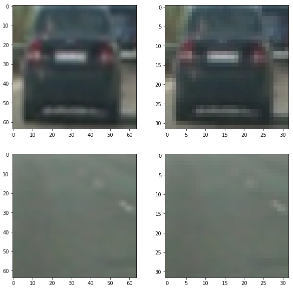
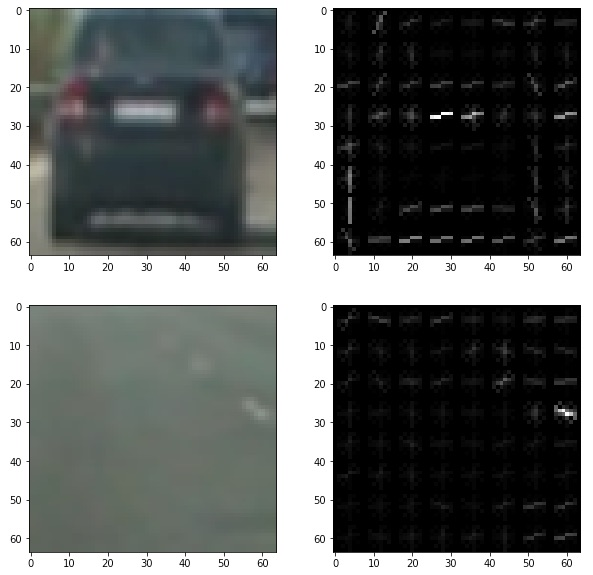
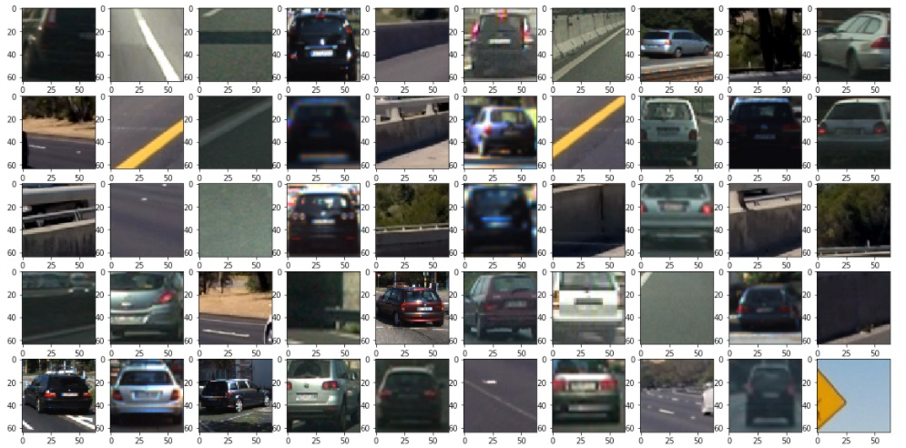
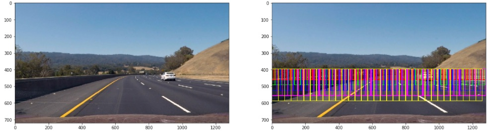
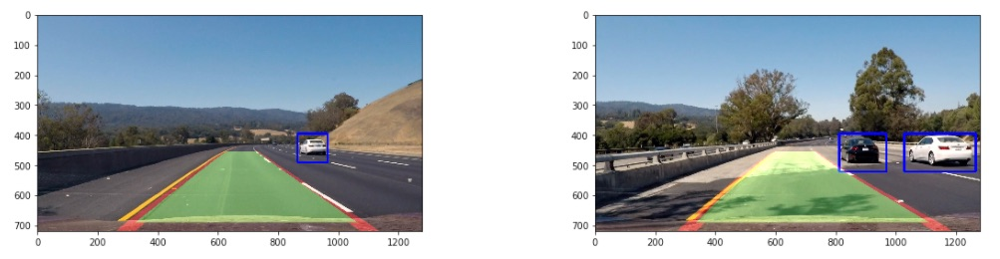

# Vehicle detection and tracking

Objective of the project is to use machine learning (support vector machines in specific) and computer vision techniques to detect other cars on road and track them in a video stream. The rest of the document is organized as:

1. [Problem setup](#problem_setup)
2. [Detection Pipeline](#detection_pipeline)
3. [Tracking Pipeline](#tracking_pipeline)
3. [Result](#results)
4. [Reflection](#reflection)

## <a name="problem_setup">Problem setup</a>
Given video of car on road with lanes and other cars, the task is to detect those cars and track them. The video is taken from the front center camera of the car. To be able to detect cars in the video, dataset of images of cars and non-cars are provided so as to train a classifer.

## <a name="detection_pipeline">Detection Pipeline</a>
Image processing and computer vision algorithms are applied to the images to detect cars in the video. In order to detect cars in video frames, we train a classifier from car and non-car images. Support vector machine with RBF kernel is used as the model used for classifier.

### Features
Three type of features are used:
1. 32x32 average pooled image.
   This is a concise representation of the image. Although lossy, it still keeps around enough information to distinguish between car and non-car.
   
2. HOG of grayscale image [pixels_per_cell=8, cells_per_block=2x2]
   This feature captures information about gradients which can identify parts of shape that make up a car. The above parameters for HOG provided good accuracy 99.26%
   
3. Histogram of all channels of HSV color space.
   Feature helps with color distribution of cars. This is something that is different for cars and non-cars.

Features are then scaled to zero mean and unit variance using StandardScaler. This will prevent any single feature to dominate learning.

### Dataset stats
* Total vehicle images: 8792
* Total non-vehicle images: 8968
* Train/test split was 80%/20%.

#### Dataset Exploration

### Gridsearched final parameters of the classifier
Type: SVC
Kernel: rbf
c: 10
Accuracy: 99.26%

## <a name="tracking_pipeline">Tracking Pipeline</a>
Tracking pipeline implements tracking of cars in the video. A sliding window over video frame is passed to the classifier to detect if the window contains a car. A bounding box is then drawn on the the detected window. Detailed pipeline:

1. Slide square window (of size 64, 96, 128, 160 and 196) from the middle of the image. This is done in parallel using 16 threads.
   
2. Extract above features for each of the window. [For HOG features, we compute HOG features once and subsample the values]
3. Predict the presence of car using the trained SVM classifier.
4. For each window that detects car, add a vote on a heat map sized same as the video frame image.
5. Smooth the heat_map by averaging across historical frames. The exact logic smooths by choosing the moving window (size 7) average of heat_maps that maximizes total value of votes over the last 15 frames.
6. Threshold heat map for atleast 2 votes per pixel and extract contiguous non-zero pixels as different detected cars.
7. Draw bounding boxes on the detected images.

## <a name="results">Result</a>
#### Pipeline on Test images

#### Pipeilne on Video
[Video](https://github.com/rohithmenon/carnd/blob/master/vehicle_detection/output/project_video.mp4?raw=true) with detected cars and lane markings.

## <a name="reflection">Reflection</a>
The pipeline works pretty well on the project video. In spite of smoothing there is little jitter in the bounding box. Detection and tracking is pretty slow in spite of running tracking logic in parallel. End to end deep learning has been active area of research and training a model to directly classify pixels of image as from car or not would be a good alternative. [You only look once, https://arxiv.org/abs/1506.02640] will be a much more robust and end to end solution. But the scope of this project is to use specific techniques and hence did not explore the approach. Such an approach generalises well and also allows for realtime object detection.
